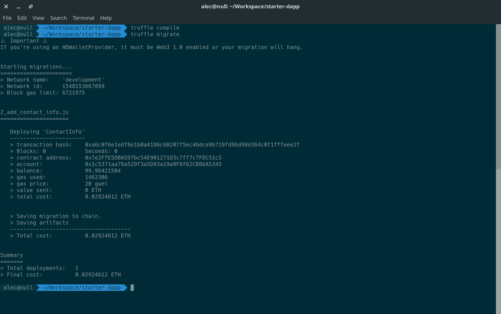

# Solidity Developer Environment Tutorial

## Preface

This tutorial assumes an understanding of the fundamentals of Ethereum and the EVM. If you are a looking to begin developing your own smart contracts in Solidity, and have had previous development experience, this tutorial is for you.

## Toolkit

### Ganache

If you have learned enough about Ethereum, more specifically, the EVM, then you will likely wonder how developing smart contracts on your local machine could work in a time-efficient and debug-friendly manner. Rather than using a testnet, which requires test ETH from a faucet and still takes time to mine, or creating our own private Ethereum network with our own genesis block and miners, we can simply use a great tool called Ganache.

[Ganache](https://truffleframework.com/ganache) will create a local development network as well as generate several test accounts and prefill them with ~100 test Ether. Ganache also works as a Web3.js provider, so you can plug and play with existing codebases.

*If you would like to know how to setup your own custom private Ethereum network as well, check out [this article](https://medium.com/cybermiles/running-a-quick-ethereum-private-network-for-experimentation-and-testing-6b1c23605bce).*

### Truffle

[Truffle](https://truffleframework.com/truffle) is a full-fledged developer environment for Ethereum. It includes tools that assist developers with contract deployment, migrations, tests, networks, as well as a great CLI and interactive console. Truffle allows you to get away from things like the [Remix IDE](https://remix.ethereum.org), which is fully in-browser, and use your own IDEs and tools you're already comfortable with.

We will use Truffle for compiling and deploying our contracts, as well as executing them via Transactions.

## Getting Started

First, we will get our dependencies installed. You'll need to have a Node.js environment setup to use the Truffle Suite.

Install Truffle and Ganache-CLI:

```
npm install -g truffle ganache-cli
```

Create a new directory for our project and traverse it:

```
mkdir starter-dapp
cd starter-dapp
```

Initialize the project with Truffle:

```
truffle init
```

Voila! You should now see a directory structure that looks like this when you run `tree`:

```
.
├── contracts
│   └── Migrations.sol
├── migrations
│   └── 1_initial_migration.js
├── test
└── truffle-config.js

3 directories, 3 files
```

Now, we need to get our local dev EVM server running! Easy, in a separate terminal simply run:

```
ganache-cli
```


*If you ever need to reset your environment, you can just kill and restart the server, which will generate an entirely new blockchain and a new set of prefilled accounts. Your migrations will work as if they were run the first time.*

At this point, we will modify the `truffle-config.js` to enable the "development" network to connect Truffle to Ganache.

Within that file, un-comment the block that contains the development configuration. The default settings will work perfectly.

Your networks config should look something like this:


If everything goes correctly, we are now ready to compile and migrate our first contract. If you look within the contracts folder, you will see `Migrations.sol` -- this is a contract that helps to keep track of contract deployments. Migrations is a useful feature of Truffle, as contracts are immutable and need to be managed as such.

Let's build and deploy the initial project:

```
truffle compile
truffle migrate
```

You should see output similar to this:


## Creating a New Contract

Now it's time to create our own contract. In this case, we will be using a ContactInfo contract as a succinct example.

First, create a new Solidity file called `ContactInfo.sol` within the contracts folder.

Here's the example contract that we will be using:

```
pragma solidity ^0.5.0;

// A simple Contact Info Smart Contract
contract ContactInfo {
    address owner;
    string public name;
    string public email;
    string public github;
    string public bitcoin;
    string public ethereum;

    constructor(
        string memory _name,
        string memory _email,
        string memory _github,
        string memory _bitcoin,
        string memory _ethereum
    ) public {
        owner = msg.sender;
        name = _name;
        email = _email;
        github = _github;
        bitcoin = _bitcoin;
        ethereum = _ethereum;
    }

    // use this to restrict functions to specific users
    // like the contract owner (you)
    modifier onlyBy(address _account) {
        require(msg.sender == _account, "Not authorized!");
        _; // original function
    }

    // use this to transfer ownership to a new address
    // if you created a new key/wallet
    function changeOwner(address newOwner) public onlyBy(owner) {
        owner = newOwner;
    }

    function changeName(string memory newName) public onlyBy(owner) {
        name = newName;
    }

    function changeEmail(string memory newEmail) public onlyBy(owner) {
        email = newEmail;
    }

    function changeGithub(string memory newGithub) public onlyBy(owner) {
        github = newGithub;
    }

    function changeBitcoin(string memory newAddress) public onlyBy(owner) {
        bitcoin = newAddress;
    }

    function changeEthereum(string memory newAddress) public onlyBy(owner) {
        ethereum = newAddress;
    }
}
```

This simple contract creates several variables that are set upon contract deployment, and can be changed only by the owner of the contract (i.e, the deployer). The contract also contains a function to transfer the contract ownership in the case of switching keys/wallets. More detail regarding function modifiers in Soldity can be found [here](https://medium.com/blockchannel/the-use-of-revert-assert-and-require-in-solidity-and-the-new-revert-opcode-in-the-evm-1a3a7990e06e). You can find Solidity's documentation [here](https://solidity.readthedocs.io/en/v0.5.0/).

## Compiling, Deploying and Running the Contract Locally

Since our contract is ready to be deployed, we will need to create a new migration file called `2_add_contact_info.js` in the migrations folder. This is where we will add logic for passing variables to the contract's constructor and deploying it.

Add this code (with your own info) to the new migration file, or copy the code from `1_initial_migration.js` and modify as such:

```
var ContactInfo = artifacts.require("./ContactInfo.sol");

module.exports = function(deployer) {
  // Setup deployer function to pass data to contract constructor
  deployer.deploy(
    ContactInfo,
    "Alec M. Wantoch", // name
    "alec@wantoch.net", // email
    "https://github.com/awantoch", // github
    "1JjEUxQgcigjvoRFQd8pyZEeMEx1873YEd", // btc address
    "0x377D0d8a98e5974cfcBCFfe5df784Ea12A720F15" // eth address
  );
};

```

Our contract is now ready to be deployed. Simply run:

`truffle compile` then
`truffle migrate` again to deploy, then
`truffle console` to start interacting with contract

Once complete, the contract will be active on your local Ganache EVM.

Your console should return something like this upon successful migration/deployment:



## Interacting with the Contract

We can check the different variables stored in the live contract as such:

Run `truffle-console`, then input:

```
let info = await ContactInfo.deployed()
info.name()
info.email()
info.ethereum()
```

You should see the same data that you passed from the constructor. Hooray!

Now, you may notice that these calls are "free" as in, they do not require Ether. This is great, since reading data is free. Mutating data on the otherhand requires a Transaction, which requires Ether.

We will need to fetch the account we used to create the contract and use it in the transaction. In this case, the default is `accounts[0]`:

```
let accounts = await web3.eth.getAccounts()
```

Now, we can call the `changeName` function from the contract while using our contract owner account:

```
info.changeName('Bob Bobbinson', {from:accounts[0]})
info.name()
```

The data stored in the contract has now been modified. Feel free to play with the other functions as well, and get a feel for the developer environment.

Congratulations! You have successfully built, deployed, and interacted with a smart contract! You should now have a solid start for beginning your smart contract developer journey.

You can find the code used in this tutorial at my [GitHub repo](https://github.com/awantoch/starter-dapp). Thank you for reading, and good luck!
